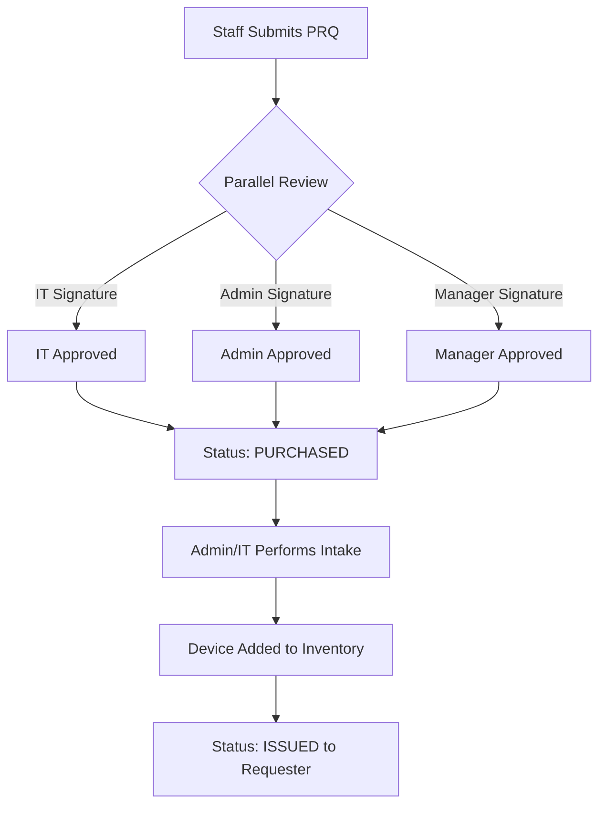
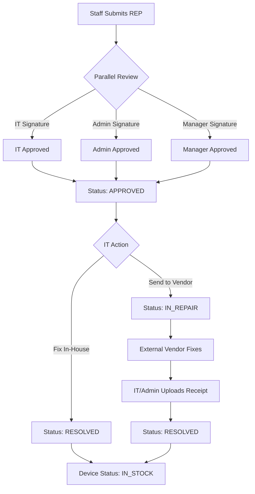
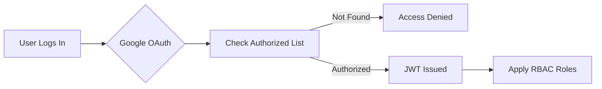

# HarisCo Internal Portal

A centralized internal portal designed for HarisCo to streamline office management. This application provides robust tools to manage employees, track hardware inventory, process multi-stage procurement requests, and handle IT repairs—all secured behind Google OAuth 2.0 and detailed audit logging.

## 🚀 Tech Stack

- **Frontend:** React, Vite, TailwindCSS, Lucide Icons
- **Backend:** Node.js, Express.js, Socket.io (Real-time)
- **Database:** SQLite with Prisma ORM
- **Authentication:** Google OAuth 2.0 (No local passwords)
- **Localization:** PKR Currency for all financial tracking

## ✨ Key Features & Workflows

### 1. Parallel Multi-Signature Workflow
We have moved away from rigid sequential steps to a faster, parallel approval system:
- **IT, Admin, and Manager Sign-offs**: All three stakeholders can review and authorize a request simultaneously.
- **Auto-Transition**: The moment all signatures are collected, the request is automatically promoted to `APPROVED` or `PURCHASED` status.
- **Visual Checklist**: Users can see exactly who has signed off in real-time via a reactive status checklist.

### 2. Real-Time Internal Chat
A built-in messaging system to facilitate quick communication between departments:
- **Instant Messaging**: Powered by Socket.io for zero-latency communication.
- **Read Receipts**: Visual confirmation when messages have been seen.
- **Role Visibility**: See the designation and role of the person you are chatting with.

### 3. User Management & RBAC
Strict Role-Based Access Control (RBAC) manages what each user can see and do:
- **IT / Admin Control**: High-level roles can authorize new users by email and assign their roles (IT, Admin, Manager, Employee).
- **Security**: There are no local passwords. Access is granted only to authorized emails via Google Sign-in.
- **Audit Trail**: Every user authorization or role change is logged for security auditing.

### 4. In-App Asset Verification
A secure, in-app viewer allows authorized users to inspect purchase or repair receipts:
- **Modal Previewer**: View Images and PDFs directly in the portal using the "Eye" icon.
- **Lifecycle Integration**: Receipts are linked directly to inventory items during the "Intake" or "Resolve" phase.

### 5. Inventory & Repairs
Track the complete lifecycle of office hardware:
- **Statuses**: `IN_STOCK`, `ISSUED`, `REPAIR`.
- **Automatic Assignment**: Procurement items are auto-assigned to the requester upon intake.
- **Repair Lock**: Devices in repair are locked to their original requester to maintain chain of custody.

### 6. Automated Backups & Audit Logs
- **Activity Logs**: Every state change (approvals, issues, resolves) is recorded in an immutable log.
- **Safety**: The system automatically generates timestamped backups of the database (`server/backups`) on every major system activity.

---

## 📊 System Workflows

### 🛒 Procurement Lifecycle


### 🔧 Repair Workflow


### 🔐 Authentication & Access


---


## 🛠️ Environments & Configuration

### 1. Development Environment
Used when actively editing code.
```bash
# Terminal 1: Backend (Port 5000)
cd server
npm install
npx prisma db push
npm run seed:local   # Populates local bypass users
npm run dev

# Terminal 2: Frontend (Port 5173)
cd client
npm install
npm run dev
```

### 2. Production Environment (Docker)
The portal is packaged as a single, self-contained Docker container. The React frontend is served directly by the Express backend (No Nginx required).

1. Move the project to the production server.
2. Configure `.env` with Google OAuth credentials.
3. Run: `docker-compose up -d --build`
4. Access via: `http://<SERVER_IP>:8080`

---

## 🔑 Access Control
1. An **IT** or **Admin** user must first authorize your email in the **User Management** tab.
2. Once authorized, log in via the **Sign in with Google** button.
3. Your permissions will be automatically applied based on your assigned role.

*(Note: Local passwords and bcrypt have been removed for enhanced security.)*
